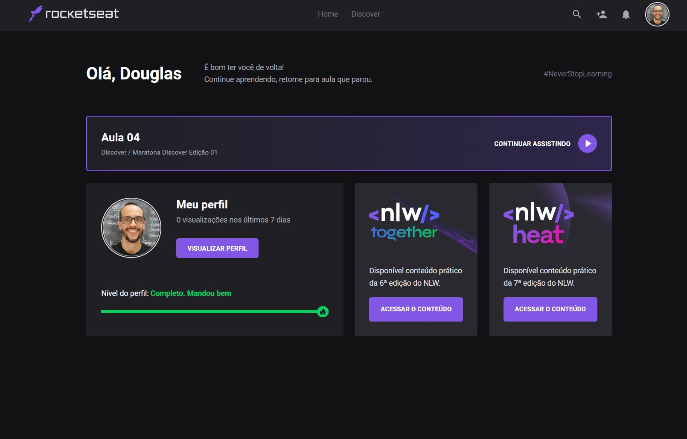

<h1 align="center">
    
</h1>

### Rocketseat - Trilha Fundamentar - 1 - O Guia Estelar de HTML

- [x] Conceitos
- [x] Trabalhando com os elementos
- [x] Links
- [x] Tabelas
- [x] . Tabelas
- [x] . Tabela Básica
- [x] . Organizando Tabelas
- [x] . Tabela Complexa
- [x] . Thead Complexa
- [x] . Tbody Complexa
- [x] . Melhorando o aspecto com colgroup
- [x] . Melhorando a acessibilidade
- [x] Cabeçalho
- [x] . Head
- [x] . Meta
- [x] . Favicon
- [x] . Meta SEO
- [x] . Meta Social

### Rocketseat - Trilha Fundamentar - 2 - O Guia Estelar de Css

- [x] Conceitos
- [x] Box Model
- [x] . border
- [x] . margin
- [x] . padding
- [x] Cascata do Css
- [x] . origem do destino: inline > tag style > tag link
- [x] Especificidade: cálculo matemático
- [x] . 0 - universal selector, combinators e negation pseudo-class (:not())
- [x] . 1 - element type selector e pseudo-elements (::before, ::after)
- [x] . 10 - classes e atribute selectors ([type="radio"])
- [x] . 100 - id selector
- [x] . 1000 - inline
- [x] At rules
- [x] . @import - incluir css externo
- [x] . @media - regras condicionais
- [x] . @font-face - fontes externas
- [x] . @keyframes - animation
- [x] Shorthand
- [x] . font-style, font-weight, font-size, line-height, font-family: font:bold, italic, .8em/1.2 Arial, sans-serif
- [x] DevTools: ferramenta para desenvolvedor no navegador
- [x] Vendor Prefix

### Rocketseat - Trilha Fundamentar - 3 - Nem tudo são pixels

- [x] Conceitos
- [x] Distâncias absolutas e relativas
- [x] Porcentagens
- [x] Position
- [x] Funções
- [x] Strings e Identificadores

### Rocketseat - Trilha Fundamentar - 4 - Uma caixa dentro da outra

- [x] Conceitos
- [x] Box Model
- [x] . box sizing
- [x] . display block: h1, h2  
- [x] . display inline: strong, a
- [x] . margin
- [x] . padding
- [x] . border outline
 
### Rocketseat - Trilha Fundamentar - 5 - Agora sim, cores

- [x] Conceitos
- [x] Cores
- [x] . keywords named values
- [x] . hexadecimal, rbg, hsl
- [x] . global values
- [x] Background
- [x] . origin-clip
- [x] . attachment

### Rocketseat - Trilha Fundamentar - 6 - Posso ver e ouvir o HTML

- [x] Conceitos
- [x] Áudio e Vídeo
- [x] Imagens

### Rocketseat - Trilha Fundamentar - 7 - Posicionando foguetes

- [x] Conceitos
- [x] Position: static, relative, absolute, fixed :: [top right bottom left z-index] 
- [x] Element Stacking
- [x] FlexBox: alinhamento, direcionamento, ordernar e tamanho :: display flex; flex-direction: column; justify-content: space-between
- [x] Grid

#### Referências das Documentações

- [HTML](https://developer.mozilla.org/en-US/docs/Web/HTML)
- [CSS](https://developer.mozilla.org/en-US/docs/Web/CSS)
- [Javascript](https://developer.mozilla.org/en-US/docs/Web/JavaScript)
- [ReactJS](https://reactjs.org/docs/getting-started.html)
